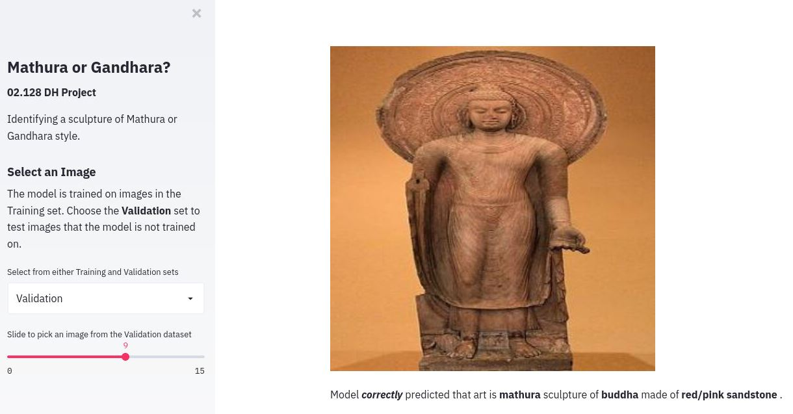

# hass-dh-mathura-gandhara

## What is this

Digital Humanities project to identify a sculpture of either Mathura or Gandhara Art styles.

For the next few weeks, a live version will be online [here](http://35.240.193.71/).

## Running the code

```
pip install -r requirements.txt

# leave it running forever on a cloud VM
nohup sudo streamlit run app.py --server.port 80 &
```

## Screenshot



